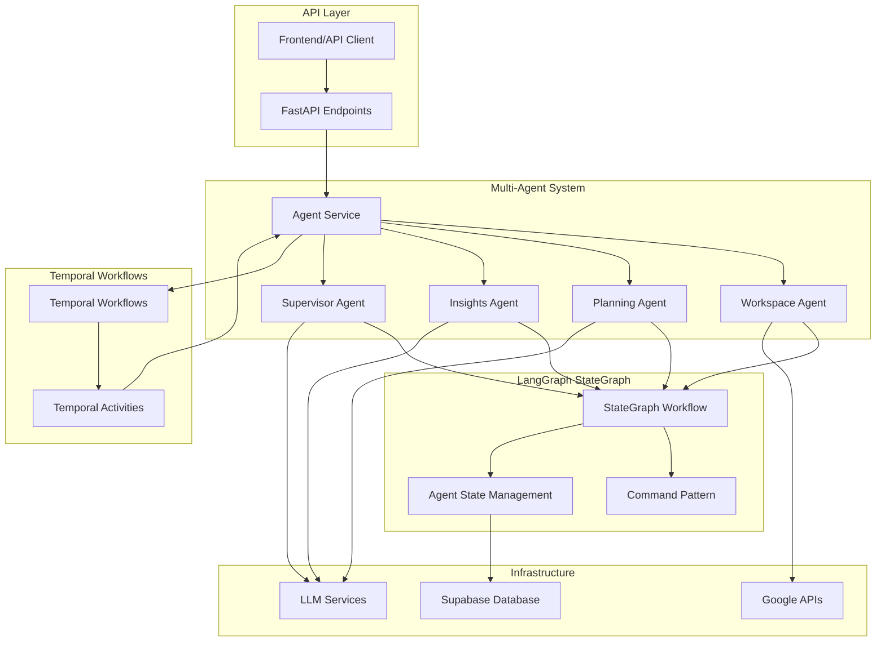

# LangGraph Multi-Agent System Architecture

## Overview

The Media Planning Platform implements a sophisticated multi-agent system using LangGraph and Temporal for intelligent campaign planning. This system coordinates multiple specialized agents to automate complex media planning workflows with enterprise-grade reliability and state management.

## System Architecture



## Agent System Components

### 1. Agent Service (`app/services/langgraph/agent_service.py`)

**Purpose**: Central coordination service for all agents
- **Initialization**: Sets up and manages all agent instances
- **Health Management**: Monitors agent health and availability
- **Task Execution**: Routes tasks to appropriate agents
- **State Management**: Coordinates shared state across agents

**Key Features**:
- Singleton pattern for global access
- Supabase integration for state persistence
- Comprehensive health checking
- Error handling and logging

### 2. Workspace Agent (`app/services/langgraph/agents/workspace_agent.py`)

**Purpose**: Data ingestion and workspace management
- **Google Sheets Integration**: Parses campaign data from spreadsheets
- **File Processing**: Handles various file formats and data extraction
- **Data Validation**: Ensures data quality and consistency
- **Workspace Management**: Organizes files and metadata

**Tools**:
- `GoogleSheetsReader`: API integration for spreadsheet parsing
- `FileParser`: Multi-format file processing
- `DataValidator`: Data quality checks
- `WorkspaceManager`: File organization and metadata tracking

### 3. Planning Agent (`app/services/langgraph/agents/planning_agent.py`)

**Purpose**: Campaign strategy development and optimization
- **Budget Optimization**: Advanced allocation algorithms across campaigns
- **Channel Selection**: Optimal marketing channel recommendations
- **Timeline Planning**: Project timeline generation with milestones
- **Strategy Generation**: Comprehensive campaign strategy development

**Tools**:
- `BudgetOptimizer`: Performance-based budget allocation
- `CampaignPlanner`: Strategic campaign development
- `StrategyGenerator`: AI-powered strategy creation
- `ResourceAllocator`: Optimization of resource utilization

### 4. Insights Agent (`app/services/langgraph/agents/insights_agent.py`)

**Purpose**: Performance analysis and data-driven insights
- **Performance Analysis**: Statistical analysis of campaign data
- **Trend Detection**: Advanced pattern recognition and forecasting
- **Insight Generation**: AI-powered actionable recommendations
- **Benchmark Comparison**: Performance evaluation against standards

**Tools**:
- `DataAnalyzer`: Statistical analysis with comprehensive metrics
- `TrendDetector`: Pattern recognition with significance testing
- `InsightGenerator`: Actionable recommendations with priority scoring
- `PerformanceEvaluator`: Benchmark comparison with industry standards

### 5. Supervisor Agent (`app/services/langgraph/agents/supervisor_agent.py`)

**Purpose**: Workflow orchestration and decision-making
- **Task Coordination**: Orchestrates tasks across multiple agents
- **Decision Making**: Intelligent routing based on agent results
- **Quality Control**: Validates outputs and ensures data quality
- **Conflict Resolution**: Resolves conflicts between agent recommendations

## StateGraph Workflow System

### StateGraph Implementation (`app/services/langgraph/workflows/supervisor.py`)

The system uses LangGraph's StateGraph pattern for coordinated multi-agent workflows:

```python
# StateGraph Structure
workspace_agent -> planning_agent -> insights_agent -> supervisor_agent -> completion
```

**Key Features**:
- **Conditional Routing**: Dynamic transitions based on agent results
- **Error Handling**: Comprehensive error states and recovery
- **State Persistence**: Automatic state saving at each transition
- **Execution History**: Complete audit trail of workflow execution

### Command Pattern (`app/services/langgraph/commands.py`)

Implements robust command patterns for inter-agent communication:

**Command Types**:
- `AgentHandoffCommand`: Agent-to-agent task delegation
- `DataRequestCommand`: Data sharing between agents
- `TaskAssignmentCommand`: Task assignment and prioritization
- `ResultDeliveryCommand`: Result passing and validation
- `WorkflowControlCommand`: Workflow state management

### State Management (`app/services/langgraph/workflows/state_models.py`)

**AgentState Model**:
- Multi-agent coordination (current_stage, next_agent, active_tasks)
- Agent communication (agent_messages, agent_results, agent_errors)
- Business context (tenant_id, user_id, session_id)
- Data containers (workspace_data, campaign_plan, insights_data)

## Advanced Infrastructure Components

### 1. State Manager (`app/services/langgraph/state_manager.py`)

**Enterprise-Grade State Management**:
- **Rate Limiting**: Configurable operation weights and tenant isolation
- **Resource Management**: Concurrent operation limits and memory monitoring
- **State Recovery**: Automatic checkpoint creation and integrity validation
- **Cross-Tenant Isolation**: Secure multi-tenant state management

### 2. Error Handler (`app/services/langgraph/error_handler.py`)

**Advanced Error Handling**:
- **Circuit Breaker Pattern**: Automatic failure detection and recovery
- **Retry Mechanisms**: Exponential backoff with intelligent exception handling
- **Error Categorization**: Automatic classification of error types
- **Centralized Reporting**: Structured error records and statistics

### 3. Resource Manager (`app/services/langgraph/resource_manager.py`)

**Resource Management & Optimization**:
- **Memory Monitoring**: Real-time tracking with configurable thresholds
- **Connection Pooling**: Managed pools with automatic cleanup
- **Workflow Timeout Handling**: Asynchronous timeout management
- **Agent Execution Throttling**: Resource-aware throttling with priority queuing

### 4. Monitoring System (`app/services/langgraph/monitoring.py`)

**Comprehensive Observability**:
- **Performance Metrics**: Counter, gauge, histogram, and timer metrics
- **Distributed Tracing**: Span management and hierarchical trace organization
- **State Transition Monitoring**: Workflow stage transitions with role tracking
- **Resource Utilization**: System health monitoring with automated status determination

## Temporal Integration

### Workflows (`app/temporal/workflows/agent_workflows.py`)

**AgentTaskWorkflow**:
- Executes individual agent tasks with retry logic
- Provides durable execution with timeout handling
- Automatic state persistence via Temporal

**MultiAgentWorkflow**:
- Orchestrates complete multi-agent workflows
- Coordinates StateGraph execution via Temporal
- Handles long-running campaign planning workflows

**AgentHealthMonitorWorkflow**:
- Periodic health monitoring and maintenance
- Automatic resource cleanup and optimization
- System health alerting and diagnostics

### Activities (`app/temporal/activities/agent_activities.py`)

**Core Activities**:
- `execute_agent_task_activity`: Single agent task execution
- `get_agent_health_activity`: System health checks
- `execute_supervisor_workflow_activity`: StateGraph orchestration
- `validate_agent_configuration_activity`: Configuration validation
- `cleanup_agent_resources_activity`: Resource cleanup and maintenance

## API Integration

### Endpoints (`app/api/v1/endpoints/agents.py`)

**RESTful API Interface**:
- `GET /agents/health`: System health status
- `GET /agents/`: List all available agents
- `POST /agents/execute`: Execute individual agent tasks
- `POST /agents/workflow`: Execute multi-agent workflows
- `GET /agents/workflow/{id}/status`: Workflow status tracking
- `GET /agents/{type}/health`: Individual agent health

**Features**:
- Comprehensive request/response schemas
- Tenant-aware multi-tenancy support
- Async/sync execution modes via Temporal
- Detailed error handling and logging

## Configuration Management

### Agent Configuration (`app/services/langgraph/config.py`)

**LangGraphConfig**:
- Agent-specific configurations and prompts
- Tool definitions and capabilities
- System-wide settings and parameters
- Environment-specific overrides

**AgentType Enum**:
- `WORKSPACE`: Data ingestion and management
- `PLANNING`: Campaign strategy and optimization
- `INSIGHTS`: Performance analysis and recommendations
- `SUPERVISOR`: Workflow orchestration and coordination

## Database Schema

### Agent States Table (Supabase)

```sql
CREATE TABLE agent_states (
    id UUID PRIMARY KEY DEFAULT gen_random_uuid(),
    tenant_id TEXT NOT NULL,
    user_id TEXT,
    session_id TEXT NOT NULL,
    agent_type TEXT NOT NULL,
    state_data JSONB NOT NULL,
    created_at TIMESTAMP WITH TIME ZONE DEFAULT NOW(),
    updated_at TIMESTAMP WITH TIME ZONE DEFAULT NOW(),
    checksum TEXT
);

-- Indexes for performance
CREATE INDEX idx_agent_states_tenant_session ON agent_states(tenant_id, session_id);
CREATE INDEX idx_agent_states_agent_type ON agent_states(agent_type);
CREATE INDEX idx_agent_states_updated_at ON agent_states(updated_at);
```

## Security & Compliance

### Multi-Tenant Security
- **Tenant Isolation**: Complete data separation between tenants
- **Access Control**: Role-based permissions and authentication
- **Data Encryption**: End-to-end encryption for sensitive data
- **Audit Logging**: Complete audit trail for compliance

### API Security
- **Authentication**: JWT-based authentication with refresh tokens
- **Rate Limiting**: Per-tenant and per-user rate limiting
- **Input Validation**: Comprehensive input sanitization
- **CORS Configuration**: Secure cross-origin resource sharing

## Performance & Scalability

### Optimization Features
- **Connection Pooling**: Efficient database and API connections
- **Caching Strategy**: Multi-level caching for frequently accessed data
- **Async Processing**: Non-blocking operations for improved throughput
- **Resource Throttling**: Intelligent resource allocation and limiting

### Scalability Considerations
- **Horizontal Scaling**: Stateless design for easy scaling
- **Load Balancing**: Support for multiple instance deployments
- **Database Optimization**: Efficient queries and indexing strategies
- **Temporal Scaling**: Distributed workflow execution

## Deployment & Operations

### Health Monitoring
- **Service Health**: Comprehensive health checks for all components
- **Agent Health**: Individual agent status monitoring
- **Performance Metrics**: Real-time performance and resource monitoring
- **Alerting**: Automated alerts for system issues

### Maintenance Operations
- **State Cleanup**: Automatic cleanup of old state data
- **Resource Management**: Proactive resource monitoring and management
- **Error Recovery**: Automatic error detection and recovery procedures
- **Performance Tuning**: Continuous optimization based on metrics

## Future Enhancements

### Planned Features
- **Custom Agent Types**: Support for user-defined agent types
- **Advanced Analytics**: Enhanced performance analytics and reporting
- **Machine Learning Integration**: ML-powered optimization and insights
- **API Gateway Integration**: Enhanced security and rate limiting
- **Real-time Collaboration**: Multi-user workflow collaboration

### Integration Roadmap
- **Additional LLM Providers**: Support for multiple AI providers
- **Enhanced Google APIs**: Expanded Google Workspace integration
- **Third-party Integrations**: Support for additional marketing platforms
- **Advanced Workflows**: More sophisticated workflow templates 